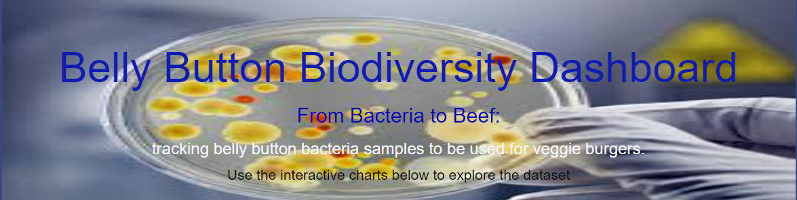
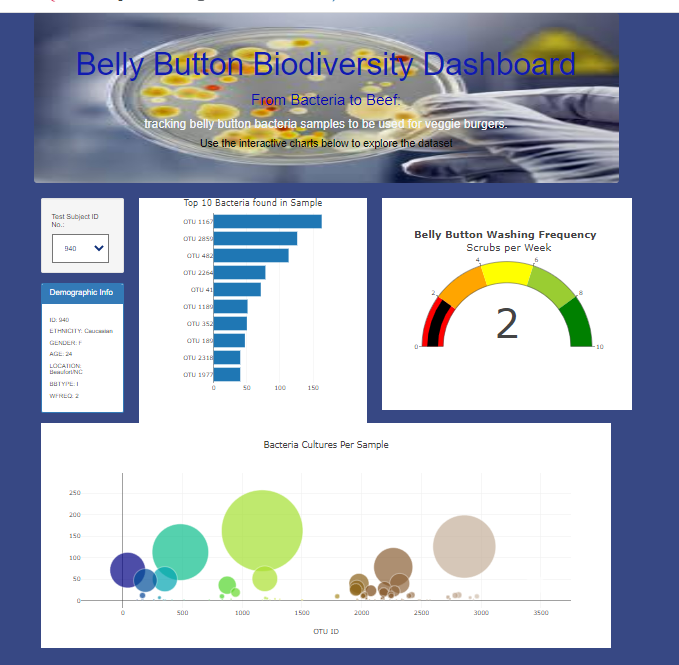
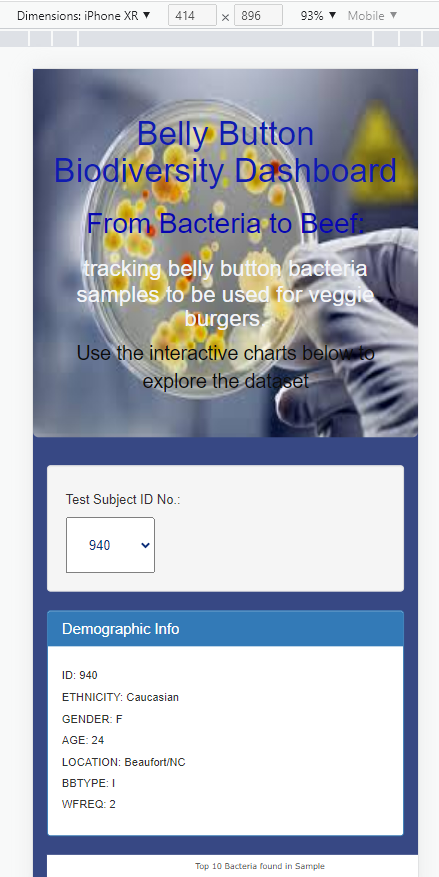

## Belly Button Biodiversity Dashboard
Module 12 Exercise

## Overview
A biological researcher is interestered in bacteria that have the ability synthesize protiens that taste like beef.  The researcher partnered with the company Improbable Beef, a food start up, to research possible bacterial species. As part of this research, human belly buttons have been swabbed for bacteria that could provide the next best synthetic beef taste. 

This website provides a dashboard for logging and tracking navel swab results. Specifically, the volunteers should be able to identify the top 10 bacterial species in their belly buttons. That way, if Improbable Beef identifies a species as a candidate to manufacture synthetic beef, the volunteers will be able to identify whether that species is found in their navel.

## Deliverables Met:
- Deliverable 1: Create a Horizontal Bar Chart
- Deliverable 2: Create a Bubble Chart
- Deliverable 3: Create a Gauge Chart
- Deliverable 4: Customize the Dashboard
  - Image added to jumbtron
  - Added background color changes to site.
  - Website is mobile-responsive.

 

          
